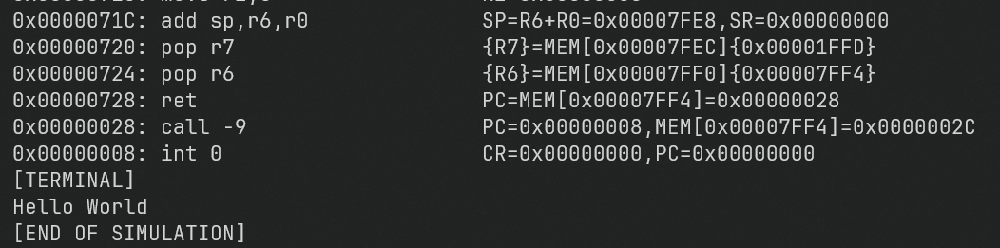

# Tiny C Compiler

This project tries to extend tiny c compiler to support `Poxim Architecture`

## Requirements
- C++14 capable compiler
- C99 capable compiler
- Linux (Only)

## Compiling TCC with Poxim Backend

$ ./configure --cpu=poxim 

$ make run CXX=clang++ CC=gcc

Feel free to change the **CXX** variable to another C++14 capable compiler. Same goes for **CC** variable.

This will compile **tcc** with Poxim Backend and run it on the **examples/main.c** file that produces **examples/bin/main.bin** binary file. By default it also runs the other examples.

Now inspect ``examples/out/`` folder. You'll see both `interp` and `dump` folder that contains the output of interpretation and dumping of **examples/bin/main.bin** file respectively.

If you just want to compile the tcc-poxim you can run $ `make all` instead.

## Running Minimal Example

You can edit the file ``examples/minimal.c`` that already includes the minimal setup

run $ ``make examples`` to compile and interpret the same way as the other examples

## Compiling your own input.c

$ ./tcc input.c -o output.bin

##### **Important**

The output is raw binary poxim machine code with **no runtime**, **statically linked**, with **no libc**, you have to define `_start` function/label yourself, also for copying array and struct (in argument passing for example) you need to define memset and memmove as well, see `examples/_start.h` to see how it can be done.

### Memory Dump

$ ./poxim-dump --bin input.bin output.dump

### Execution

Execute the bytes, the machine code.

$ ./poxim-interp --bin input.bin output.interp

This will create two files called **output.interp** and **output.term**.

The **output.term** has the output of poxim terminal. The other one has both the tracing and terminal.
This is done because it might be slow to open **output.interp**.

## Playground Replit

Open Replit link below and press the ``play`` button to compile the C compiler **tcc-poxim** (executable is named only ``tcc``), compile all `.c` files in the `examples` folder using **tcc-poxim**,  **dump** and **interpret** these files in the  ``examples/out/dump/`` and ``examples/out/interp/`` respectively.

- https://replit.com/@ExCyberse/tinycc-poxim

To edit the files you can fork it such as this:

For a demonstration of how it's supposed to work, see this video {{youtube video of me compiling and running tcc-poxim on Replit here}}

## Doc

Look folder `docs` there will have 3 pdfs  and 1 video

#### PDFs:
  - 2023-10-02-IHS-Apresentacao.pdf, this one is my real life presentation of the project
  - Poxim-Instruction-Set.pdf, this is the instruction set for the Poxim Architecture         
  - Poxim-Backend-Details.pdf, this pdf show how tcc-poxim works internally, what are the limitations and features implemented. (will be added soon)

#### Video:
  - TCC-Compile,Dump,Interpret.mkv, this is a video of me compiling and running tcc-poxim

## Resources Used
- Avr port of TCC https://github.com/thethumbler/avr-tcc
- Another option https://github.com/chaoslawful/tcc
- Kernel with tcc https://wiki.osdev.org/TCC

## Tips

If you're cross compiling for i386 ``pacman -S lib32-glibc`` is necessary. This might be useful for comparing outputs
